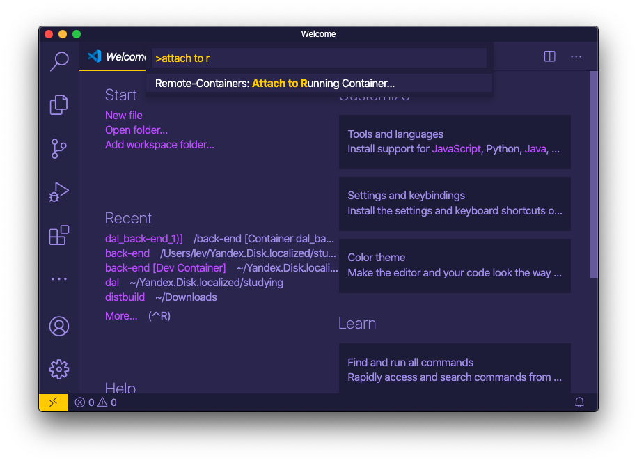

# Development environment

All of the following instructions require Docker.

Docker containers provide production-like environment, stable builds,
and no need for manual management of third-party packages and dependencies.

**WARNING:**
local environments are highly discouraged and will not be supported.

## Table of contents

- [Development environment](#development-environment)
  - [VS Code](#vs-code)
  - [PyCharm](#pycharm)

## VS Code

### Requirements

* Docker
* VS Code Extensions:
  * Docker
  * Python
  * Remote - Containers

### Steps

1. Run `back-end` container in terminal from project root:
   ```shell script
   docker-compose up --build back-end
   ```
   
1. Open command palette and choose `Attach to running container`:
   
   
1. Select `back-end` container.

## PyCharm

### Requirements

* Docker

### Steps

1. Make sure Docker is running:
   ```shell script
   docker info
   ```

1. In `PyCharm`:
   1. Navigate to `Settings / Preferences` > `Project` > `Project Interpreter`,
      press `⚙` to the right of the `Project Interpreter` field > `Add`:
      

   2. Add new interpreter from Docker Compose configuration:
      

1. You are good to go.
