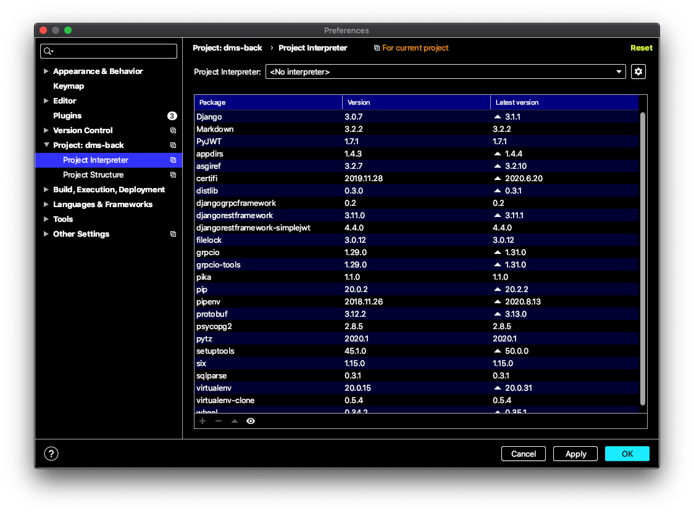
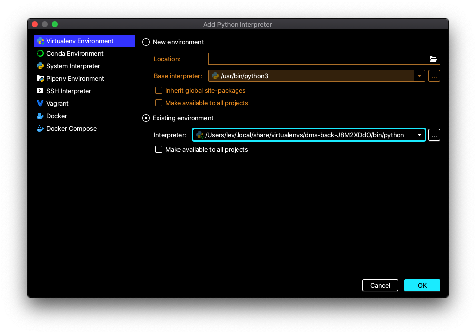

# Development environment

## Table of contents

- [Development environment](#development-environment)
  - [Terminal + Text Editor (Vim, Emacs, ...)](#terminal--text-editor-vim-emacs-)
      - [Requirements](#requirements-0)
      - [Steps: Python](#steps-python)
      - [Steps: PostgreSQL](#steps-postgresql)
  - [PyCharm](#pycharm)
    - [With Docker _(highly recommended)_](#with-docker-highly-recommended)
      - [Requirements](#requirements-1)
      - [Steps](#steps-0)
    - [Local Machine _(somewhat discouraged)_](#local-machine-somewhat-discouraged)
      - [Requirements](#requirements-2)
      - [Steps](#steps-1)

## Terminal + Text Editor (Vim, Emacs, ...)

### Requirements

* `pyenv`
* `pipenv`
* `postqresql`

### Steps: Python

1. First things first, make sure that `pyenv` and `pipenv` are installed and working:
   ```shell script
   pyenv --version && pipenv --version
   ```
1. Navigate to the project root:
   ```shell script
   cd dms-back
   ```
1. Install python 3.8.5:
   ```shell script
   pyenv install 3.8.5
   ```
1. Activate it for the project:
   ```shell script
   pyenv local 3.8.5
   ```
1. Make new virtual environment and install all packages from `pipfile`:
   ```shell script
   pipenv install --dev
   ```
1. Activate project's virtualenv:
   ```shell script
   pipenv shell
   ```

### Steps: PostgreSQL

1. Install [`postgresql`](https://www.postgresql.org/download/).
1. From the project's root, export variables from `.env` file:
   ```shell script
   set -o allexport
   source .env
   set +o allexport
   ```
1. Create database:
   ```shell script
   createdb $DB_NAME
   ```

## PyCharm

Follow these instructions to set up development environment for `PyCharm`.

### With Docker _(highly recommended)_

Docker container provides production-like environment, stable builds,
and no need for manual management of third-party packages and dependencies.

#### Requirements

* Docker

#### Steps

1. Make sure Docker is running:
   ```shell script
   docker info
   ```
1. In `PyCharm`:
   1. Navigate to `Settings / Preferences` > `Project` > `Project Interpreter`,
      press `⚙` to the right of the `Project Interpreter` field > `Add`:
      
   2. Add new interpreter from Docker Compose configuration:
      
1. You are good to go.

### Local Machine _(somewhat discouraged)_

Note that if Docker is unavailable, you will have to manually configure `PostgreSQL`.

#### Requirements

* Same as for [terminal](#terminal--text-editor-vim-emacs-)

#### Steps

1. Complete all steps from the [terminal](#terminal--text-editor-vim-emacs-) section.
1. Make sure `python --version` yields `3.8.5` and get path to `python` binary:
   ```shell script
   $ which python
   SOME_VERY_LONG_PATH
   ```
1. In `PyCharm`:
   1. Navigate to `Settings / Preferences` > `Project` > `Project Interpreter`,
      press `⚙` to the right of the `Project Interpreter` field > `Add`:
      
   1. Choose `Virtualenv Environment` > `Existing environment`, paste `SOME_VERY_LONG_PATH` to `Interpreter` field: 
      
1. Done.
