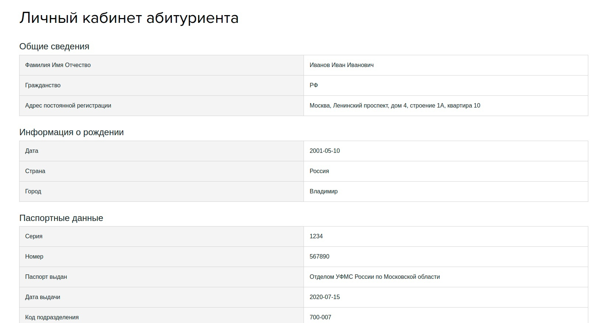

# Пользовательская документация для личного кабинета абитуриента

С помощью этого руководства, вы узнаете, как зарестрироваться в системе DAL в качестве абитуриента и подать документы в ВУЦ с ее помощью. 

## Регистрация

Для начала регистрации необходимо перейти на сайт https://dal.mtc.hse.ru/applicant-registration/

В появившееся поле вводим свой адрес корпоративной почты, заканчивающийся на edu.hse.ru

После нажатия на кнопку "Зарегистрироваться", вам должно прийти письмо на эту почту. Вкладку с регистрацией можно закрыть.

На письмо отвечать не нужно, достаточно нажать на ссылку "нажмите сюда". Откроется страница с заданием пароля.

Вводим пароль и подтверждаем его. Нажимаем кнопку "Зарегистрироваться".

После нажатия на кнопку сразу происходит переадресация на страницу для входа в систему. Входим через корпоративную почту и заданный пароль.

## Личный кабинет

### Подача заявки

Чтобы подать заявку на поступление в Военный учебный центр НИУ ВШЭ, пройдите форму по кнопке "Пройти форму"

1. Общие сведения

    На вкладке "Общие сведения" необходимо заполнить все поля - фамилия, имя, отчество (при наличии), гражданство, адрес постоянной регистрации, ФИО в родительском падеже.

    

    После заполнения нажимаем кнопку "Дальше"

2. Информация о рождении

    На вкладке "Информация о рождении" необходимо заполнить все поля - дата рождения, страна и город, где Вы родились.

    

3. Паспортные данные

    На вкладке "Паспортные данные" необходимо заполнить все поля, основываясь на данных актуального паспорта - серия, номер, место выдачи, дата выдачи, код подразделения.

    

4. ИНН и СНИЛС

    На вкладке "ИНН и СНИЛС" необходимо заполнить индивидуальный номер налогоплательщика, а также номер СНИСЛС.

    

5. Информация о ВУЗе

    На вкладке "Информация о ВУЗе" необходимо заполнить все поля - номер студенческого билета (например, "М123БМИЭФ321"), образовательная программа, номер группы (например, "БИТ 201").

    

6. Военный комиссариат

    На вкладке "Военный комиссариат" необходимо заполнить поле, продолжив фразу "Состою на воинском учете в военном комиссариате...".

    

7. Контактная информация

    На вкладке "Контактная информация" необходимо заполнить все поля - личная почта (не корпоративная), номер телефона.

8. Фотография

    На вкладке "Фотография" необходимо прикрепить фотографию в формате .png, .jpg или .jpeg с соотношением сторон 3 на 4.

    
    
    При желании удалить фотографию и загрузить новую, необходимо навести на название загруженного файла и нажать крестик, после снова нажать на "Выберите файл".

9. Данные о матери

    На вкладке "Данные о матери" заполняются вся необходимая информация о матери. При необходимости поля остаются пустыми.

    

10. Данные об отце

    На вкладке "Данные об отце" заполняются вся необходимая информация о отце. При необходимости поля остаются пустыми.

    

11. Данные о братьях

    На вкладке "Данные о братьях" заполняются вся необходимая информация о братьях, при их добавлении на кнопку "Добавить брата". Братьев можно удалять по нажатию на крестик у вкладки. При необходимости поля остаются пустыми.

    

12. Данные о сестрах

    На вкладке "Данные о сестрах" заполняются вся необходимая информация о братьях, при их добавлении на кнопку "Добавить сестру". Сестер можно удалять по нажатию на крестик у вкладки. При необходимости поля остаются пустыми.

    

13. Желаемая военная специальность

    На вкладке "Желаемая военная специальность" в открывающемся списке выбирается ВУС, по которой абитуриент будет участвовать в конкурсе и учиться после успешной сдачи нормативов.

    

14. Соглашение

    На последней вкладке "Соглашение" чекбоксами дается согласие на обработку персональных данных и подтверждается правильность введенных данных.

    

После нажатия на кнопку "Отправить форму", при отсутствии ошибок заполнения проиходит отправка. Если ошибки есть, их необходимо исправить, возвращаясь назад с помощью соответствующей кнопки.

При возникновении технических трудностей абитуриенту нужно обратиться по адресу hse.mec.dal@gmail.com. В письме необходимо подробно описать ситуацию и возникшую проблему.

При успешной отправке появляется надпись "Форма успешно отправлена".

Нажимаем на кнопку "На главную" и возвращаемся в личный кабинет.

### Просмотр и исправление данных

После заполнения формы в личном кабинете появляется таблица со всеми внесенными данными.

При необходимости есть возможность исправить данные, нажав на кнопку "Исправить форму" под таблицей.